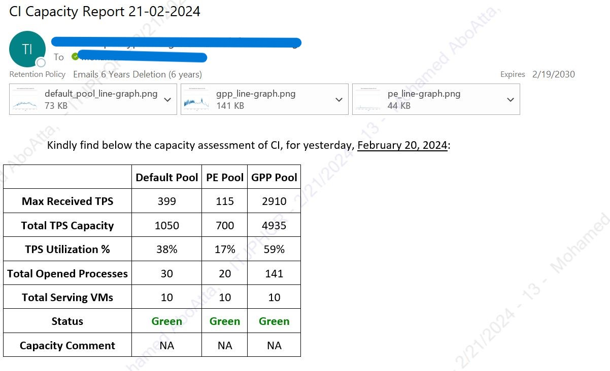
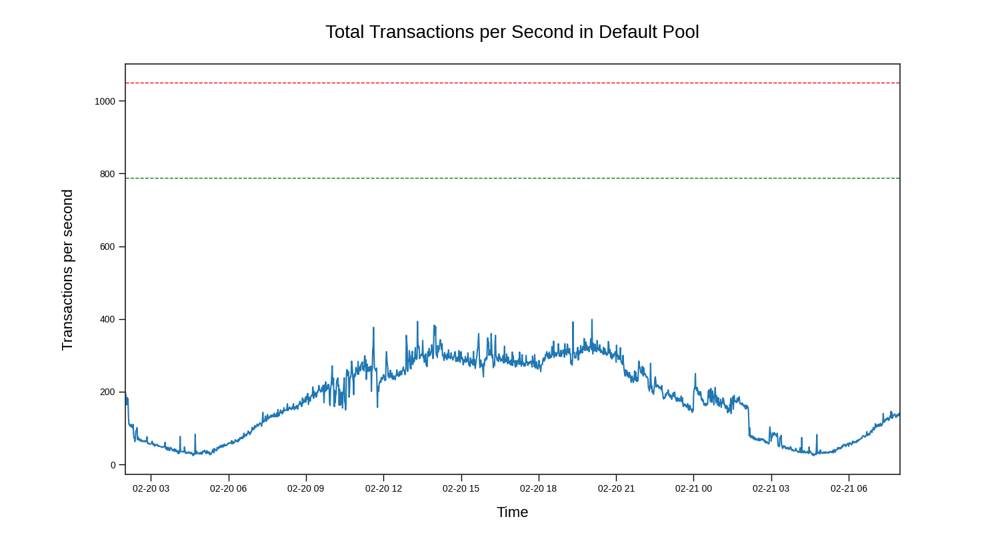
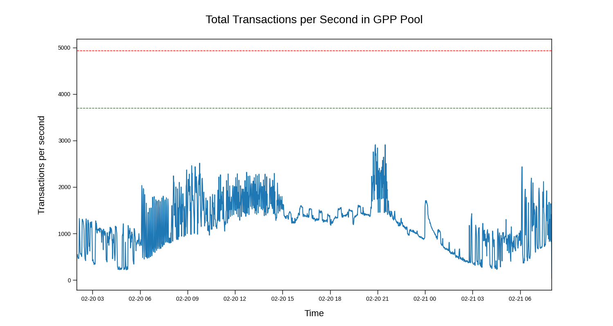
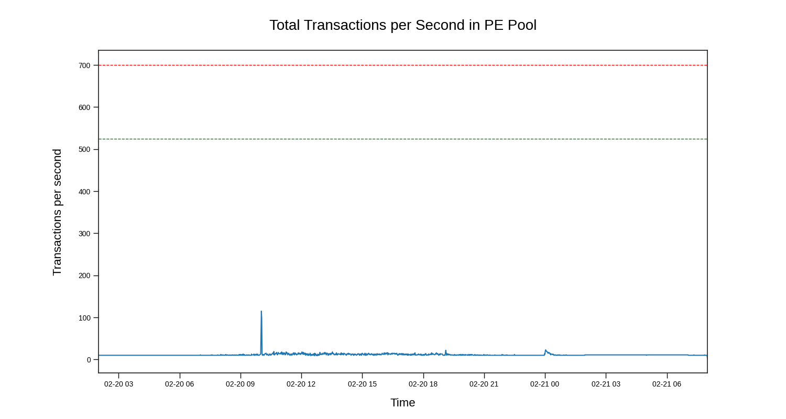
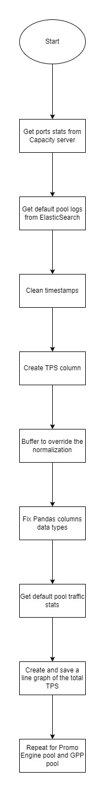

[![LinkedIn][linkedin-shield]][linkedin-url]

<!-- PROJECT LOGO -->
 

  
  <h3 align="center">CI System Capacity Zero-Touch Automation</h3>

<!-- TABLE OF CONTENTS -->

  
Table of Contents

  <ol>
    <li>
      <a href="#about-the-project">About The Project</a>
      <ul>
        <li><a href="#business-case">Business Case</a></li>
        <li><a href="#technical-solution">Technical Solution</a></li
        <li><a href="#flowchart">Flowchart</a></li>
        <li><a href="#tech-stack">Tech Stack</a></li>
      </ul>
    </li>
    <li><a href="#contact">Contact</a></li>
  </ol>

<!-- ABOUT THE PROJECT -->
## About The Project

* Project Name: CI System Capacity Zero-Touch Automation
* Version: v1.0.0
* Organization Department: Technology

### Business Case

Previously, the daily capacity assessment of the Charging Interface (CI) system involved manually extracting logs from Kibana and visualizing the data using Excel. This process, which covered three different pools of traffic, was time-consuming and prone to errors. The lack of resolution in Kibana's visualizations made manual extraction and processing necessary, leading to inefficiencies and potential inaccuracies in capacity planning and system analysis.

(<a href="#readme-top">back to top</a>)

### Technical Solution

This automation tool streamlines the entire data acquisition and analysis process for the CI system, reducing manual work and improving accuracy in capacity assessment.

**Key Features:**

* **Automated Data Acquisition:** The tool retrieves logs directly from Elasticsearch for three different pools of CI traffic, eliminating the need for manual log extraction from Kibana.

* **Capacity Assessment:** Automatically analyzes the retrieved data to calculate the capacity and maximum transactions per second for each traffic pool. This ensures a more accurate and timely assessment of system performance.

* **Report Generation & Distribution:** After performing the analysis, the tool generates a detailed report, complete with visualizations, and sends it via email to relevant stakeholders.

**Benefits:**

* **Time Efficiency:** Reduces the manual process from 2 hours daily to a fully automated, zero-touch operation.
* **Accuracy:** Automation removes the potential for human error in data extraction and visualization.
* **Scalability:** Handles data for three different traffic pools, providing comprehensive system-wide analysis without manual intervention.

(<a href="#readme-top">back to top</a>)

### Flowchart

(<a href="#readme-top">back to top</a>)

### Tech Stack

This project was developed using the following tech stack:

* Python

(<a href="#readme-top">back to top</a>)

<!-- CONTACT -->
## Contact

Mohamed AbdelGawad Ibrahim - [@m-abdelgawad](https://www.linkedin.com/in/m-abdelgawad/) - <a href="tel:+201069052620">+201069052620</a>

(<a href="#readme-top">back to top</a>)

<!-- MARKDOWN LINKS & IMAGES -->
<!-- https://www.markdownguide.org/basic-syntax/#reference-style-links -->
[linkedin-shield]: https://img.shields.io/badge/-LinkedIn-black.svg?style=for-the-badge&logo=linkedin&colorB=555
[linkedin-url]: https://www.linkedin.com/in/m-abdelgawad/
